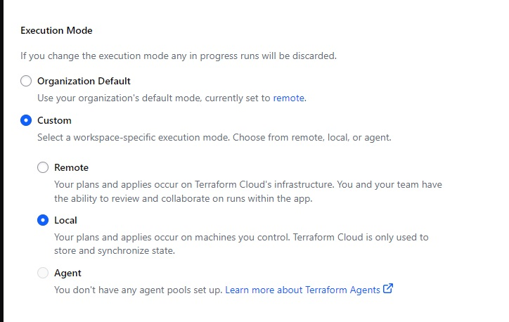
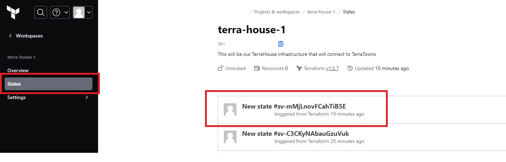

# **Terraform Beginner Bootcamp 2023**

## **Weekly Journals**

- [Week 0 Journal](/journal/week0.md)
- [Week 1 Journal](/journal/week1.md)
- [Week 2 Journal](/journal/week2.md)
- [Week 3 Journal](/journal/week3.md)

## Managing GIT Tags

https://docs.github.com/en/desktop/managing-commits/managing-tags-in-github-desktop

I forgot to `git pull` after `git checkout main` and tagged the wrong pull. I was able to fix this by deleting the tag on github and then re-opening gitpod on MAIN and re-doing the tagging process

## Dealing with Configuration Drfit

### What happens if we lose our state file?

If you lose your state file, you will likely have to tear down all your cloud infrastructure manually.

You can use Terraform import but it will not be available for all resources. You will need to check the documentation on the Terraform providers to determine which resources can be imported.

-- **Don't lose your state file**

### Fix Missing Resources with Terraform Import

https://developer.hashicorp.com/terraform/cli/import

[AWS S3 Bucket Import](https://registry.terraform.io/providers/hashicorp/aws/latest/docs/resources/s3_bucket#import)

`terraform import aws_s3_bucket.bucket bucket-name`

[Random String Terraform Import](https://registry.terraform.io/providers/hashicorp/random/latest/docs/resources/string#import)

`terraform import random_string.test test`

### Fix Manual Configuration

If someone makes a change through ClickOps(Manually), we can revert the resources to the desired state by re-running 

## Configuring Terraform Cloud for Local Execution but Cloud backup of State File

[Terraform Remote Operations](https://developer.hashicorp.com/terraform/cloud-docs/run/remote-operations)

I wanted to execute my terraform actions on the GitPod machine but also wanted the state file to be backed up to Terraform Cloud. Utilizing Terraform Cloud for execution took too long and slowed down my progress. 

>Disabling Remote Operations
>Many of Terraform Cloud's features rely on remote execution and are not available when using local operations. This includes features like Sentinel policy enforcement, cost estimation, and notifications.
>
>**You can disable remote operations for any workspace by changing its Execution Mode to Local.** This causes the workspace to act only as a remote backend for Terraform state, with all execution occurring on your own workstations or continuous integration workers.
>
>Protecting Private Environments
>Terraform Cloud Agents are a paid feature that allows Terraform Cloud to communicate with isolated, private, or on-premises infrastructure. The agent polls Terraform Cloud or Terraform Enterprise for any changes to your configuration and executes the changes locally, so you do not need to allow public ingress traffic to your resources. Agents allow you to control infrastructure in private environments without modifying your network perimeter.
>
>Terraform Cloud Agents also support running custom programs, called hooks, during strategic points of a Terraform run. For example, you may create a hook to dynamically download software required by the Terraform run or send an HTTP request to a system to kick off an external workflow.

 

1. In your Terraform Cloud Portal, navigate to your workspace and then settings

    

2. Scroll about half way down to execution mode and click custom > local

    

3. Back on your gitpod instance redo 
    - `terraform init` 
    - `terraform plan` 
    - `terraform apply`
    - `terraform destroy` (optional)

4. We now have a state and resources tracked in Terraform Cloud but it was all executed from the Terraform install in the local GitPod workspace.

    